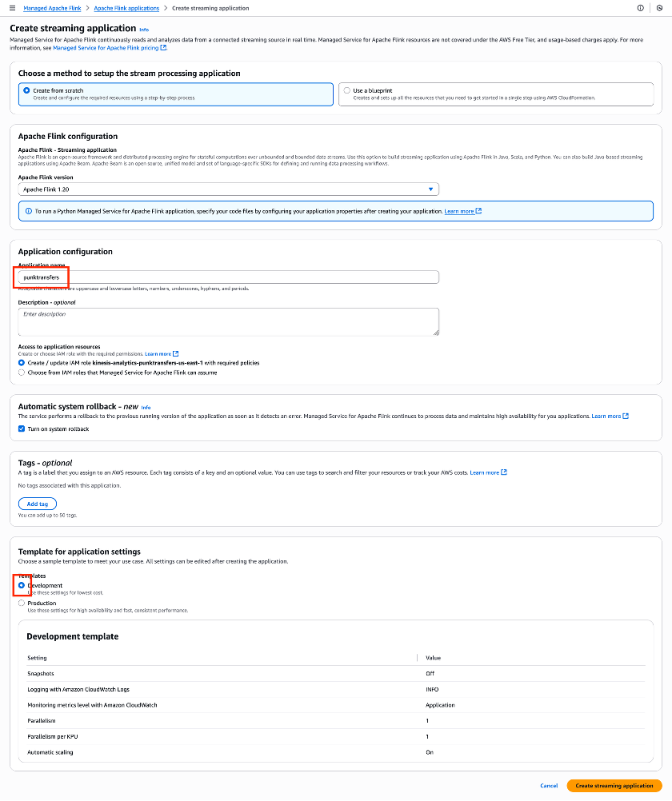
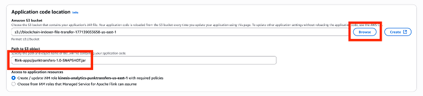
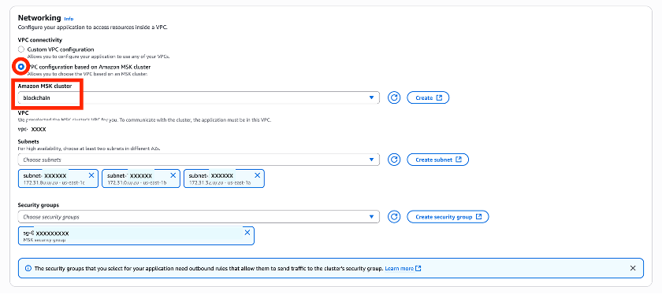
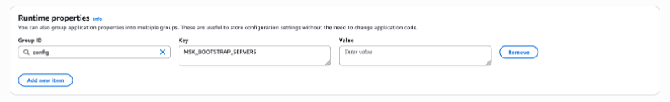

In the following guide, we demonstrate how to deploy a blockchain node and extract data using the indexer solution. Then we illustrate two example consumers to transform the data.

Let’s start by deploying the AWS infrastructure using the [AWS Cloud Development Kit (AWS CDK)](https://aws.amazon.com/cdk/) application.

# Prerequisites

Before you begin, make sure you have the following:

* The [AWS Command Line Interface (AWS CLI)](https://aws.amazon.com/cli/) installed and configured with appropriate credentials
* Node.js (v14 or later) and npm installed
* AWS CDK v2 installed globally (npm install -g aws-cdk)

# Deploy the infrastructure

To deploy the infrastructure clone this [sample-blockchain-indexer Github repository](https://github.com/aws-samples/sample-blockchain-indexer) and deploy the Indexer stack:

```
git clone https://github.com/aws-samples/sample-blockchain-indexer.git
cd sample-blockchain-indexer/infra/
npm install
cdk deploy Indexer
```

This command deploys the necessary AWS resources, which incur cost. Note that deployment can take approximately 40-60 min. Because blockchain data is in the Terrabyte range (depending on the chain), the resources are selected here to work with Etheruem mainnet data:

* An MSK cluster using m7g.xlarge instances with tiered storage
* Amazon EC2 instances for running blockchain nodes (Holesky on i8g.2xlarge and Mainnet on i8g.4xlarge). These instance types support ephemeral storage for highly utilized storage, which the blockchain node is using.
* S3 buckets for data storage and error handling
* [AWS Identity and Access Management (IAM)](https://aws.amazon.com/iam/) roles and policies for secure access between components

After deployment, note the outputs such as the MSK cluster Amazon Resource Name (ARN), virtual private cloud (VPC) ID, and EC2 instance IDs.

## Set up the blockchain node

Complete the following steps to set up the blockchain node:

### Connect to the EC2 instance using [AWS Systems Manager](https://aws.amazon.com/systems-manager/). Use the mainnet instance-id from the AWS CDK deployment output:

`aws ssm start-session --target <instance-id>`

### On the EC2 instance, switch to the blockchain user:

`sudo su blockchain`

### Install the required tools:

### Install Rust
```
cd /home/blockchain
curl --proto '=https' --tlsv1.2 -sSf https://sh.rustup.rs | sh -s -- -y
source "$HOME/.cargo/env"
```

### Build reth (execution client)
```
cd /home/blockchain/reth
make install
```

### Build cryo (data extraction tool)
```
cd /home/blockchain/cryo
cargo install --path ./crates/cli
```

### Install jaq (JSON processor)
```
cd /home/blockchain
cargo install --locked jaq
```

The following commands are for running the mainnet node. For a testnet like Holesky they must be adapted for the chain.

### Run the blockchain node using screen sessions:

### Create a screen session for reth
`screen -S reth`

Run reth (execution client) in the screen session:

### Inside the reth screen session, run:
```
reth node \
 --authrpc.jwtsecret /data/jwttoken/jwt.hex \
 --datadir /data/mainnet/reth \
 --http
```

Press **Ctrl + A, D** to detach from the screen session. Create a new screen session for lighthouse:

### Create a screen session for lighthouse
`screen -S lighthouse`

### Run lighthouse (consensus client) in the screen session:

### Inside the lighthouse screen session, run:
```
lighthouse \
 --datadir /data/mainnet/lighthouse \
 bn \
 --network mainnet \
 --checkpoint-sync-url https://beaconstate-mainnet.chainsafe.io \
 --execution-endpoint http://localhost:8551 \
 --execution-jwt /data/jwttoken/jwt.hex \
 --disable-deposit-contract-sync
```

### Set up [Amazon CloudWatch](https://aws.amazon.com/cloudwatch/) metrics for monitoring:

Make sure you’re running these one by one as the ssm-user. If you’re still logged in as the blockchain user (check with whomai if unsure), press **Ctrl + D** (or run exit) to get back to the ssm-user.

Enable the monitoring service as root:

`sudo systemctl enable lastBlock.service`

Start the timer to publish a datapoint every minute:

`sudo systemctl start lastBlock.timer`

These commands will setup a timer to publish the latest block height of the node to CloudWatch. You can find it in CloudWatch under the custom namespace Indexer as a metric per InstanceId and ChainId.

## Backfill: Extracting historical blockchain data

*Note: The backfill process can be started in parallel to the node catching up to the blockchain head. Cryo will extract data up to the specified block number. As long as that number is below the current node’s chain tip, it will work. To simplify operations, you can wait for the node to fully synchronize and then start the extraction process. That’s what we are doing here.*

After your node is synchronized, you can extract historical data:

### Create a screen session for extraction:

Switch back to blockchain user if you haven’t already:

`sudo su blockchain`

Create a screen session for the extraction:

`screen -S extract`

Run the extraction in the screen session. The two parameters -f and -t specify the first block (inclusively) and the last block (exclusively) to be extracted. The older the block number set in -f, the larger the extraction. Set -t to a block close to the actual chain head (most recent block) so that as much data is extracted via cryo as possible. A number like <chain head> - 1000 is a good starting point. *Take note of the number for starting the ExEx later*.
```
cd /home/blockchain
./scripts/extract.sh -f 0 -t 1000000
```

This will extract blocks 0–999999 from the blockchain. The extraction script uses cryo to efficiently pull blocks, transactions, and logs from the blockchain node and store them in the local file system.

There are several advantages to using *cryo* for historical data instead of the real-time ExEx:

* **Efficiency** – cryo is optimized for bulk extraction, making it much faster for historical data
* **Reliability** – The extraction can be paused and resumed without losing progress
* **Resource isolation** – Historical extraction can be resource-intensive, and using cryo keeps this separate from the real-time node operations

### Ingest the extracted data into Kafka:

`cd /home/blockchain`

### Start ingestion processes for all datasets
```
DATASETS="blocks transactions logs"
for DATASET in ${DATASETS}; do
 nohup ./scripts/ingest.sh -d ${DATASET} > ingest\_${DATASET}.log 2>&1 &
done
```

The ingestion script transforms the extracted data into the same format that our real-time extension will produce, providing consistency throughout the pipeline. This is a key benefit of the architecture—the transformation layer doesn’t need to know whether data came from historical extraction or real-time events.

Press **Ctrl + A, D** to detach from the screen session.

### Set up CloudWatch metrics for Kafka monitoring:

Make sure you’re running these one by one as the ssm-user. If you’re still logged in as the blockchain user (check with whomai if unsure), press **Ctrl + D** (or run exit) to get back to the ssm-user.

Enable the monitoring service as root:

`sudo systemctl enable monitor\_kafka.service`

Start the timer to publish a datapoint every minute:

`sudo systemctl start monitor\_kafka.timer`

## Forward filling: Set up the Kafka emitter for real-time data

Although historical data extraction with cryo is great for backfilling, we need a real-time solution for ongoing data. This is where our custom reth ExEx comes in. Complete the following steps:

### Copy the ExEx source code from the local machine to the EC2 instance:

On your **local machine**, tar the exex source code and upload it to S3. Make sure you’re in the sample-blockchain-indexer folder:

### Create the archive
`tar -czvf kafka-emitter.tar.gz --exclude="./kafka-emitter-exex/target" kafka-emitter-exex`

### Get S3 Bucket
`TRANSFER_BUCKET=$(aws s3api list-buckets --query "Buckets[?starts_with(Name, 'blockchain-indexer-file-transfer')].Name" --output text)`

### Upload archive
`aws s3 cp kafka-emitter.tar.gz s3://${TRANSFER_BUCKET}`

Back on the **EC2 instance** (make sure you’re user blockchain) download the source code:

### Get S3 Bucket
```
cd /home/blockchain
TRANSFER_BUCKET=$(aws s3api list-buckets --query "Buckets[?starts_with(Name, 'blockchain-indexer-file-transfer')].Name" --output text)
```

### Download archive
`aws s3 cp s3://${TRANSFER_BUCKET}/kafka-emitter.tar.gz .`

### Extract archive
`tar -xzf kafka-emitter.tar.gz`

### Build the Kafka emitter (as user blockchain):

### Build the emitter
```
cd /home/blockchain/kafka-emitter-exex/
cargo build --release
```

Now we can implement the unidirectional data flow pattern by having the blockchain node push data directly to our pipeline instead of having an indexer pull data from the node.

### Stop the existing reth node:

### Reattach to the reth screen
`screen -r reth`

Press **Ctrl + C** to stop the reth node.

### Run the reth node with the Kafka emitter extension. Use the same number as --exex-start-block that you as to block (-t) during the extraction.
```
cd /home/blockchain/kafka-emitter-exex
# Run the exex
cargo run --bin kafka-emitter \
 -- node \
 --authrpc.jwtsecret /data/jwttoken/jwt.hex \
 --chain mainnet \
 --datadir /data/mainnet/reth \
 --http \
 --exex-topic-prefix ethereum \
 --exex-start-block 1000000
```
Replace 1000000 with the block number where your historical extraction ended. This provides seamless continuation of data extraction.

The Kafka emitter will now complete the following actions:

* Connect to your running blockchain node
* Extract new blocks, transactions, and logs as they arrive
* Transform the data into JSON format
* Publish the data to Kafka topics (ethereum-blocks, ethereum-transactions, ethereum-logs)

This approach demonstrates the unidirectional data flow pattern we discussed earlier. The blockchain node itself is responsible for pushing data to the pipeline, rather than having an external process pull data from it. This reduces load on the node and creates a cleaner architecture.

In the next section, we show how to consume and transform the data from the Kafka topics.

## Consume the data

Now that we have both historical and real-time data flowing into Kafka, let’s set up Apache Flink applications to transform this raw data into useful formats. This is where we benefit from the separation of extraction and transformation—we can create multiple transformations that all consume the same source data. For the example we simplify the architecture a bit and use AWS CloudWatch as custom sink for the data. Instead of just logging the events, this could be a database, another Kafka queue, or a durable storage like Amazon S3.


## Example Transform: CryptoPunks transfers

[CryptoPunks](https://cryptopunks.app/) is one of the most iconic NFT collections on Ethereum. Let’s build a Flink application to track all CryptoPunks transfers:

### Copy the flink source code from the local machine to EC2:

On your **local machine**, tar the flink code and upload it to S3. Make sure you’re in the sample-blockchain-indexer folder:

### Create the archive
`tar -czvf flink.tar.gz flink`

### Get S3 Bucket
`TRANSFER_BUCKET=$(aws s3api list-buckets --query "Buckets[?starts_with(Name, 'blockchain-indexer-file-transfer')].Name" --output text)`

### Upload archive
`aws s3 cp flink.tar.gz s3://${TRANSFER_BUCKET}`

Back on the **EC2 instance** (make sure you’re user blockchain) download the source code:

`cd /home/blockchain`

### Get S3 Bucket
`TRANSFER_BUCKET=$(aws s3api list-buckets --query "Buckets[?starts_with(Name, 'blockchain-indexer-file-transfer')].Name" --output text)`

### Download archive
`aws s3 cp s3://${TRANSFER_BUCKET}/flink.tar.gz .`

### Extract archive
`tar -xzf flink.tar.gz`

### Compile the source code into a JAR-file and upload it to the transfer S3 bucket:

`cd /home/blockchain/flink/punktransfers/ && mvn clean package`

This will have created punktransfers-1.0-SNAPSHOT.jar, that needs to be uploaded to the S3 bucket:

```
cd /home/blockchain/flink/punktransfers/
TRANSFER_BUCKET=$(aws s3api list-buckets --query "Buckets[?starts_with(Name, 'blockchain-indexer-file-transfer')].Name" --output text)
aws s3 cp target/punktransfers-1.0-SNAPSHOT.jar s3://${TRANSFER_BUCKET}/flink-apps/
```

### Create the PunkTransfers application:

Create the application with the AWS Managed Apache Flink console. Set the name to punktransfers and select the development template. Leave the other setting at their defaults:



Once it has been created, configure it by clicking ‘Configure’ and set some values:

Set the application code location to use the S3 transfer bucket. Browse and select the filetransfer bucket, add the path to the S3 object.



Scroll down to the networking section and select the Kafka cluster:



This will automatically select the correct subnets and security groups.

Set the runtime properties to inform the application of the Kafka cluster:



Set the group ID to config, the Key to MSK\_BOOTSTRAP\_SERVERS and the value to the bootstrap servers for your cluster. You can get the from the MSK console or vial AWS CLI:
```
MSK_CLUSTER_ARN=$(aws cloudformation describe-stacks --stack-name Indexer --query 'Stacks[0].Outputs[?OutputKey=='KafkaClusterArn'].OutputValue' --output text)
MSK_BOOTSTRAP_SERVERS=$(aws kafka get-bootstrap-brokers --cluster-arn $KAFKA_CLUSTER_ARN --query "BootstrapBrokerStringSaslIam" --output text)
echo ""
echo Runtime parameters for Flink application
echo
echo MSK_BOOTSTRAP_SERVERS: ${MSK_BOOTSTRAP_SERVERS}
```

Save the changes and wait until it is configured.

### Modify the FLink IAM policy to allow access to Kafka:

On the punktransfers overview page you see the IAM role that application uses. Click on it to modify it. On the next screen click on **Add Permissions** and **Attach inline policy**. In the JSON view paste the following permissions, save, and name the policy “KafakPolicy”.
```
{
 "Version": "2012-10-17",
 "Statement": [
 {
 "Action": [
 "kafka-cluster:AlterCluster",
 "kafka-cluster:Connect",
 "kafka-cluster:DescribeCluster",
 "kafka:DescribeCluster",
 "kafka:DescribeClusterV2",
 "kafka:GetBootstrapBrokers",
 "kafka-cluster:\*Topic\*",
 "kafka-cluster:ReadData",
 "kafka-cluster:WriteData",
 "kafka-cluster:AlterGroup",
 "kafka-cluster:DescribeGroup"
 ],
 "Resource": "\*",
 "Effect": "Allow"
 },
 {
 "Action": [
 "logs:CreateLogGroup",
 "logs:CreateLogStream",
 "logs:DescribeLogGroups",
 "logs:DescribeLogStreams",
 "logs:PutLogEvents"
 ],
 "Resource": "arn:aws:logs:us-east-1:177139033658:\*",
 "Effect": "Allow"
 },
 {
 "Action": [
 "cloudwatch:PutMetricData",
 "ec2:DescribeSecurityGroups",
 "ec2:DescribeSubnets",
 "ec2:DescribeVpcs"
 ],
 "Resource": "\*",
 "Effect": "Allow"
 }
 ]
}
```
### Run the punktransfers application:

Back on the Flink console, click **Run**, accept the default values on the next screen, and click **Run**. This starts the application in Flink, you can watch the output in CloudWatch. Each punktransfer will show up as a Cloudwatch event.

### Monitoring and Troubleshooting

Our blockchain indexer includes several monitoring capabilities:

1. **CloudWatch Metrics**: Track the latest block numbers from the blockchain node and Kafka topics
2. **CloudWatch Logs**: Monitor Flink application logs for errors and performance
3. **Amazon MSK Monitoring**: Track Kafka cluster performance and health

## Cleanup

If you want to delete the resources that you created you have to delete the Flink application manually either on the Flink console or via AWS CLI. Run the commands on your local machine:

# Stop application
`aws kinesisanalyticsv2 stop-application \
 --application-name punktransfers`

Wait until the application has stopped (check on the Flink console) and delete the application:

# Delete application
```
aws kinesisanalyticsv2 delete-application \
 --application-name punktransfers \
 --create-timestamp $(aws kinesisanalyticsv2 describe-application --application-name punktransfers --query 'ApplicationDetail.CreateTimestamp' --output text) \
 --region ${REGION}
```

After the application has been deleted you can clean up the CDK stack from your local machine with:

`cdk destroy`

