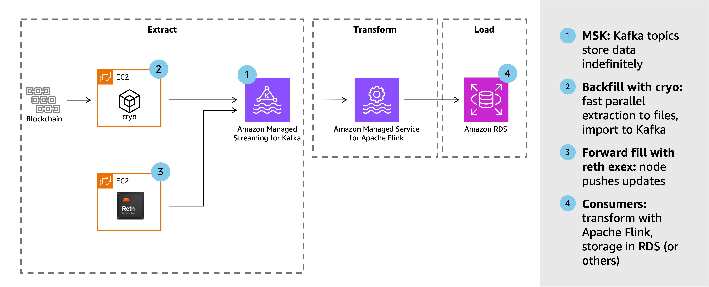

# Blockchain Indexer on AWS

This project provides a complete solution for running a blockchain indexer on AWS. It extracts data from an Ethereum blockchain, processes it, and stores it in a structured format for analysis and querying. The solution consists of three main components:

1. **Infrastructure** - An [AWS Cloud Development Kit (CDK)](https://aws.amazon.com/cdk/) script that deploys all necessary AWS resources
2. **Kafka Emitter** - A [reth execution extension (exex)](https://reth.rs/exex/overview) that extracts data from the blockchain and publishes it to [Amazon Managed Streaming for Apache Kafka](https://aws.amazon.com/msk)
3. **Flink Application** - An [Amazon Managed Service for Apache Flink](https://aws.amazon.com/managed-service-apache-flink) application that transforms the raw blockchain data into structured formats

## Architecture

When fully deployed, the project has this architecture:



## Project Structure

```
├── infra/                # CDK infrastructure code (TypeScript)
├── flink/                # Apache Flink processing code (Java)
├── kafka-emitter-exex/   # reth ExEx for emitting data to Kafka (Rust)
└── README.md             # This file
```

## How It Works

The blockchain indexer operates through the following components:

1. **Blockchain Node**: A [reth](https://reth.rs) node that syncs with the Ethereum blockchain and provides access to block data
2. **Data Extraction**:
   - **Historical Data**: [cryo](https://github.com/paradigmxyz/cryo) extracts historical blockchain data
   - **Real-time Data**: A custom reth execution extension (exex) captures new blocks as they arrive
3. **Data Pipeline**:
   - **Amazon MSK**: Stores raw blockchain data in Kafka topics
   - **Apache Flink**: Processes and transforms the data in real-time
   - **Amazon RDS**: Stores the processed data in a relational database for querying

## Prerequisites

Before getting started, ensure you have:

- AWS account with appropriate permissions
- AWS CLI configured with your credentials
- Node.js and npm installed (for CDK)
- Java Development Kit (JDK) 11+ (for Flink)
- Rust toolchain (for the Kafka emitter)

## Deployment Steps

### Step 1: Infrastructure (CDK)

Navigate to the `infra/` directory to deploy the AWS infrastructure using CDK:

```bash
cd infra/
npm install
cdk deploy
```

For detailed instructions, see the [infrastructure README](infra/README.md).

### Step 2: Kafka Emitter

The reth execution extension for emitting data to Kafka is in the `kafka-emitter-exex/` directory:

```bash
cd kafka-emitter-exex/
cargo build --release
```

For detailed instructions on configuring and running the emitter, see the [Kafka emitter README](kafka-emitter-exex/README.md).

### Step 3: Flink Transformers

The Apache Flink application for data transformation is in the `flink/` directory:

```bash
cd flink/
mvn clean package
```

For detailed instructions on deploying the Flink application, see the [Flink README](flink/README.md).
